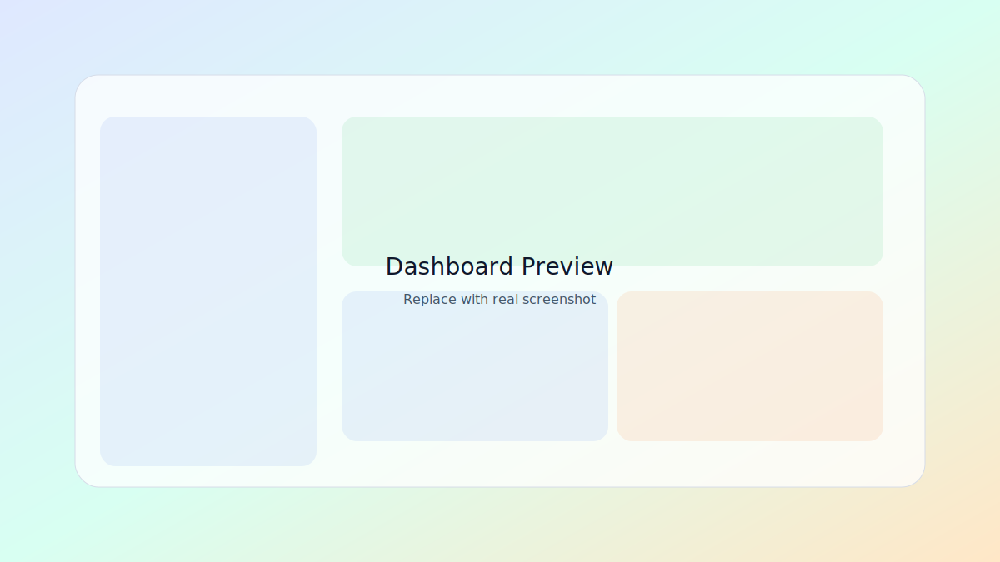
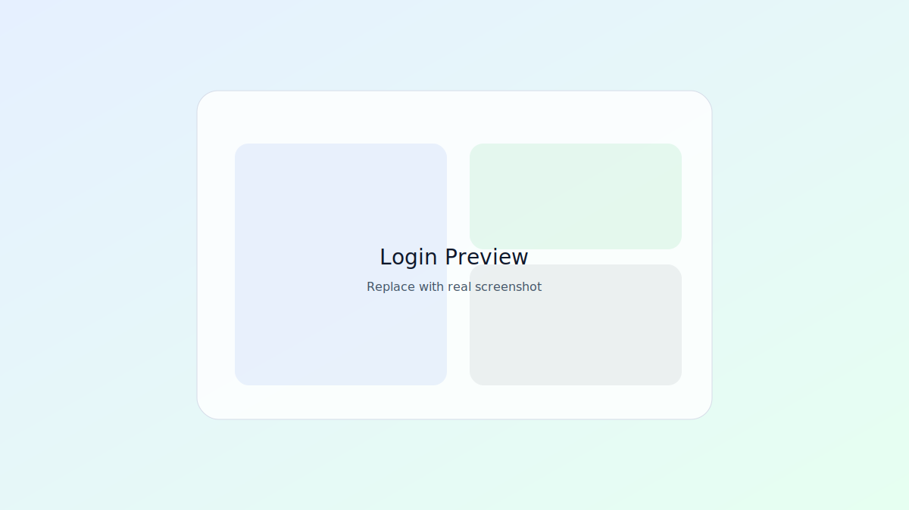
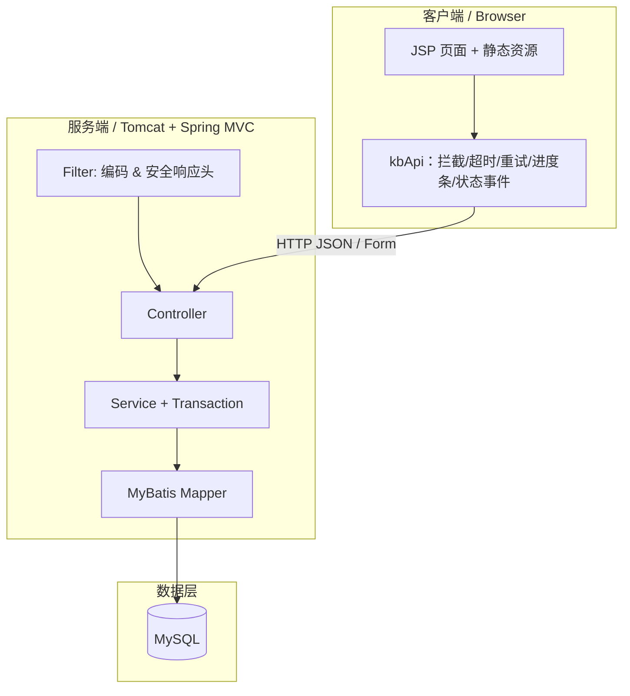
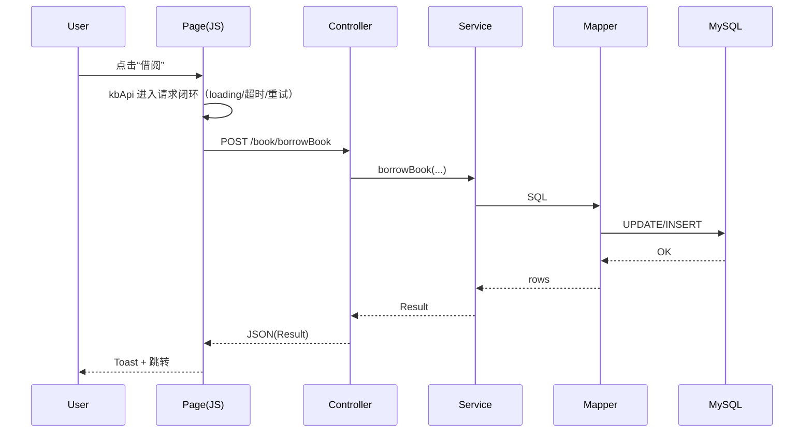

# K-Book 云借阅图书管理系统

> 面向“借阅效率 + 管理体验”的轻量级图书借阅管理系统：更少依赖、更强安全默认、更一致的 UI 语言。





---

## 亮点特性（面向生产风格的默认值）

### UI / UX
- 玻璃拟态 + 极光背景的管理后台 UI（统一主题变量、组件化布局）
- Bento Grid 仪表盘，关键动作一眼可见
- 快捷键帮助面板与筛选计数，提升检索效率
- 登录体验增强（CapsLock 提示 / 密码可视 / 提示自动淡出）
- 页面加载遮罩与状态汇总，降低操作不确定性
- 导出 CSV / 本页条数提示 / 无数据自动禁用导出

### 借阅流程
- 借阅 / 归还 / 归还确认清晰闭环
- 借阅归还日期后端校验（90 天内）
- 输入归一化（空格收敛 / 数字净化 / 邮箱小写）

### 安全默认
- 登录口令采用 PBKDF2-SHA256 + 随机盐（支持旧明文口令自动升级）
- 基础安全响应头默认启用（防止常见点击劫持/嗅探等风险）
- CSRF 防护：关键写接口强制校验 `_csrf` / `X-CSRF-Token`（前端自动注入）
- CSP 强化：移除内联事件处理与 `javascript:` 链接，启用 Nonce 脚本策略
- 仓库中不再保存明文 Token / 密钥（部署脚本已改为环境变量注入）

### 依赖与性能
- 前端运行时：纯原生 JS + 自研 Modal（移除 jQuery / Bootstrap 运行时依赖）
- 协议压缩：WAR 内置 GZIP Filter，压缩 HTML/JSON/CSS/JS，弱网更友好
- Maven Wrapper：无需本机安装 Maven 即可构建
- 依赖升级：Spring / MyBatis / Jackson 等升级到安全版本，替换 Log4j 为 Logback

---

## 技术栈
- Java 17
- Spring MVC 5.3 + MyBatis 3.5 + PageHelper
- JSP + 原生 CSS/JS（无 jQuery/Bootstrap 运行时依赖）
- MySQL 8（Connector/J）+ HikariCP
- Logback（SLF4J）
- Maven Wrapper（`mvnw` / `mvnw.cmd`）
- Docker（可选：Tomcat 9 + JDK 17）

---

## 架构概览



关键链路：JSP/原生 JS → `kbApi`（请求闭环）→ Controller → Service（事务）→ Mapper（SQL）→ DB。  
更完整的分层与时序图见：`docs/index.md`、`docs/ARCHITECTURE.md`。

<details>
<summary><strong>借阅链路（时序图）</strong></summary>



</details>

---

## 快速开始（推荐 Maven Wrapper）

### 0. 前置要求
- JDK 17+
- MySQL（或使用 Docker Compose）

### 1. 初始化数据库
任选其一：
- 方式 A：使用 `deploy/docker-compose.yml` 启动 MySQL（自动导入 `deploy/init.sql`）
- 方式 B：手动创建数据库并导入 `deploy/init.sql`

### 2. 配置环境变量
复制 `.env.example` 并根据实际环境设置，或直接在系统环境变量中配置：

```bash
DB_DRIVER
DB_URL
DB_USER
DB_PASSWORD
```

### 3. 构建 WAR

Windows：
```bash
.\mvnw.cmd -DskipTests package
```

macOS / Linux：
```bash
./mvnw -DskipTests package
```

产物：`target/cloudlibrary-1.0-SNAPSHOT.war`

### 4. 部署运行
- 外部 Tomcat 9（JDK 17）部署 `war`
- 或使用 `Dockerfile` 构建镜像后运行

---

## 默认账号（初始化脚本）
初始化脚本 `deploy/init.sql` 内置示例账号：

- 管理员：`itheima@itcast.cn` / `Admin@123456`
- 读者：`zhangsan@itcast.cn` / `User@123456`

> 提示：示例账号仅用于演示。若用于真实环境，请务必修改账号与口令，并限制数据库外网访问。

---

## 目录结构

```text
K-Book
├─ .github/               # CI 工作流
├─ .mvn/                  # Maven Wrapper 资源
├─ deploy/                # 部署脚本与数据库初始化
├─ docs/                  # 预览图与文档资产
├─ src/main/java/         # 后端代码
├─ src/main/resources/    # 配置与 MyBatis 映射
├─ src/main/webapp/       # JSP 与静态资源
├─ mvnw / mvnw.cmd        # Maven Wrapper 入口
└─ pom.xml
```

---

## 交互式文档入口

本项目文档支持 **可折叠导航（`<details>`）+ Mermaid 架构图**，推荐从入口页开始：

- 入口：`docs/index.md`
- 建议阅读顺序：`docs/index.md` → `docs/ARCHITECTURE.md` → `docs/DEPLOYMENT.md` → `docs/API.md`

> 说明：Mermaid 图在 GitHub 会自动渲染；若在本地阅读，建议用支持 Mermaid 的 Markdown 查看器。

---

## 工程自诊断（浏览器控制台）

管理端内置零依赖诊断脚本，默认 **按需加载**（减少首屏 JS 成本），打开控制台即可使用：

- 一次性快照：`kbHealth()`（会自动加载诊断脚本并输出快照）
- 手动加载：`kbLoadDiagnostics().then(() => kbDiagnostics.start(2000))`
- 停止采样：`kbDiagnostics.stop()`（需已加载诊断脚本）
- URL 自动加载：访问管理端时加上 `?kbDiagnostics=1`

---

## 文档索引
- `docs/index.md`：交互式文档入口（可折叠导航 + Mermaid 图）
- `docs/STYLE_GUIDE.md`：UI 样式指南
- `docs/DEPLOYMENT.md`：部署指南
- `docs/ARCHITECTURE.md`：架构概览
- `docs/FAQ.md`：常见问题
- `docs/API.md`：接口速览
- `docs/DB_SCHEMA.md`：数据结构
- `docs/ROADMAP.md`：路线图
- `CHANGELOG.md`：版本更新记录
- `CONTRIBUTING.md`：贡献流程

---

## 未来进化蓝图（3 个版本推演）

> 目标：在保持“借阅流程清晰 + 管理体验稳定”的前提下，逐步从“单体 JSP 应用”演进到“可观测、可扩展、可持续交付”的产品形态。

### v1.1（稳定性与可观测性优先）
- 引入数据库迁移工具（Flyway/Liquibase），让 `deploy/init.sql` 从“初始化脚本”演进为“可重复演进的迁移链”
- 增加健康检查与运行信息（例如 `/health`、`/version`），为容器化与监控打底
- 统一日志结构（requestId/用户信息/耗时）并补齐关键业务链路埋点（登录、借阅、归还、确认）
- 增加最小化自动化测试（Mapper/Service 级别）与 CI 校验（构建 + 格式 + 简单安全检查）

### v1.2（API 优先与“前后端边界”清晰化）
- 抽象并固化 API（版本化 `/api/v1/*`），将 UI 渲染从“强耦合 Controller”逐步转为“API + 视图薄层”
- 引入权限模型升级（RBAC 权限点、操作审计日志），管理员写操作更可追溯
- 增强数据能力：更强检索（组合条件/排序/导出列选择）与基础统计（热门图书、逾期风险、活跃读者）
- 增加缓存策略（只读统计/字典类数据），减少重复查询与提升响应一致性

### v2.0（架构级演进：现代化框架与前端工程化）
- 升级到 Spring Boot 3 / Spring 6（Jakarta 命名空间），统一配置方式并提升生态兼容性
- UI 从 JSP 迁移到现代前端工程（例如 React/Vue + Vite），配套 Tree-shaking / 资源哈希 / 分包加载
- API 生成与契约化：OpenAPI/Swagger 自动生成、前后端契约校验与回归测试
- 引入更完整的安全体系（CSRF/Rate-limit/会话策略/安全审计）与可观测性（指标 + Trace）

---

## License
未声明，默认保留所有权利。
