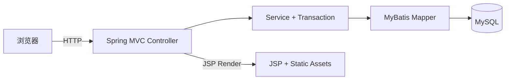

# K-Book 云借阅图书管理系统

> 面向“借阅效率 + 管理体验”的轻量级图书借阅管理系统：更少依赖、更强安全默认、更一致的 UI 语言。


---

## 亮点特性（面向生产风格的默认值）

### UI / UX
- 玻璃拟态 + 极光背景的管理后台 UI（统一主题变量、组件化布局）
- Bento Grid 仪表盘，关键动作一眼可见
- 快捷键帮助面板与筛选计数，提升检索效率
- 登录体验增强（CapsLock 提示 / 密码可视 / 提示自动淡出）
- 页面加载遮罩与状态汇总，降低操作不确定性
- 导出 CSV / 本页条数提示 / 无数据自动禁用导出

### 借阅流程
- 借阅 / 归还 / 归还确认清晰闭环
- 借阅归还日期后端校验（90 天内）
- 输入归一化（空格收敛 / 数字净化 / 邮箱小写）

### 安全默认
- 登录口令采用 PBKDF2-SHA256 + 随机盐（支持旧明文口令自动升级）
- 基础安全响应头默认启用（防止常见点击劫持/嗅探等风险）
- 仓库中不再保存明文 Token / 密钥（部署脚本已改为环境变量注入）

### 依赖与性能
- 前端运行时：纯原生 JS + 自研 Modal（移除 jQuery / Bootstrap 运行时依赖）
- Maven Wrapper：无需本机安装 Maven 即可构建
- 依赖升级：Spring / MyBatis / Jackson 等升级到安全版本，替换 Log4j 为 Logback

---

## 技术栈
- Java 17
- Spring MVC 5.3 + MyBatis 3.5 + PageHelper
- JSP + 原生 CSS/JS（无 jQuery/Bootstrap 运行时依赖）
- MySQL 8（Connector/J）+ Druid
- Logback（SLF4J）
- Maven Wrapper（`mvnw` / `mvnw.cmd`）
- Docker（可选：Tomcat 9 + JDK 17）

---

## 架构概览



关键链路：Controller → Service（事务）→ Mapper（SQL）→ JSP 渲染。

---

## 快速开始（推荐 Maven Wrapper）

### 0. 前置要求
- JDK 17+
- MySQL（或使用 Docker Compose）

### 1. 初始化数据库
任选其一：
- 方式 A：使用 `deploy/docker-compose.yml` 启动 MySQL（自动导入 `deploy/init.sql`）
- 方式 B：手动创建数据库并导入 `deploy/init.sql`

### 2. 配置环境变量
复制 `.env.example` 并根据实际环境设置，或直接在系统环境变量中配置：

```bash
DB_DRIVER
DB_URL
DB_USER
DB_PASSWORD
```

### 3. 构建 WAR

Windows：
```bash
.\mvnw.cmd -DskipTests package
```

macOS / Linux：
```bash
./mvnw -DskipTests package
```

产物：`target/cloudlibrary-1.0-SNAPSHOT.war`

### 4. 部署运行
- 外部 Tomcat 9（JDK 17）部署 `war`
- 或使用 `Dockerfile` 构建镜像后运行

---

## 默认账号（初始化脚本）
初始化脚本 `deploy/init.sql` 内置示例账号：

- 管理员：`itheima@itcast.cn` / `Admin@123456`
- 读者：`zhangsan@itcast.cn` / `User@123456`

> 提示：示例账号仅用于演示。若用于真实环境，请务必修改账号与口令，并限制数据库外网访问。

---

## 目录结构

```text
K-Book
├─ .github/               # CI 工作流
├─ .mvn/                  # Maven Wrapper 资源
├─ deploy/                # 部署脚本与数据库初始化
├─ docs/                  # 预览图与文档资产
├─ src/main/java/         # 后端代码
├─ src/main/resources/    # 配置与 MyBatis 映射
├─ src/main/webapp/       # JSP 与静态资源
├─ mvnw / mvnw.cmd        # Maven Wrapper 入口
└─ pom.xml
```

---

## 文档索引
- `docs/STYLE_GUIDE.md`：UI 样式指南
- `docs/DEPLOYMENT.md`：部署指南
- `docs/ARCHITECTURE.md`：架构概览
- `docs/FAQ.md`：常见问题
- `docs/API.md`：接口速览
- `docs/DB_SCHEMA.md`：数据结构
- `docs/ROADMAP.md`：路线图
- `CHANGELOG.md`：版本更新记录
- `CONTRIBUTING.md`：贡献流程

---

## License
未声明，默认保留所有权利。
