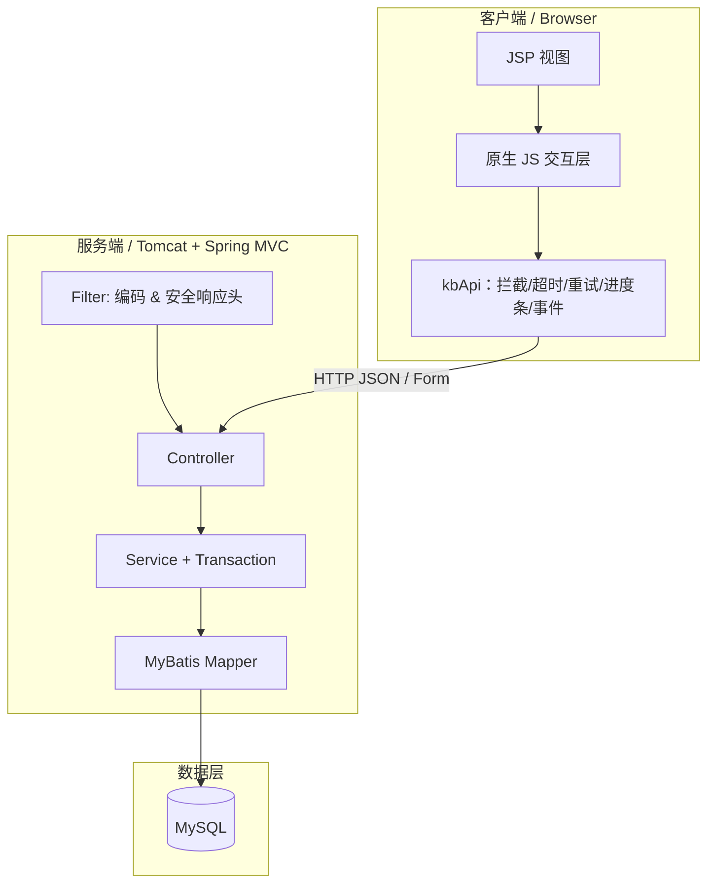
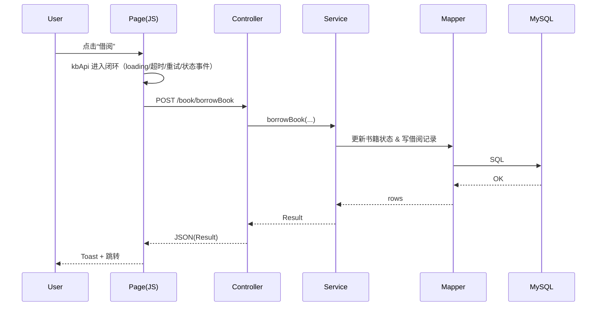

# 架构概览（多维层级）

> 目标：保持“JSP 单体”的开发与部署成本，同时在交互与工程层面补齐：请求闭环、错误一致性、UI 组件化与可演进边界。

## 1. 模块划分

- Web 层：JSP 页面 + 统一布局片段（`src/main/webapp/admin/*`）
- 静态资源层：CSS/JS/图片与主题（`src/main/webapp/css`、`src/main/webapp/js`）
- 网络层（前端）：`kbApi` 统一请求拦截（超时/重试/去重/状态事件）（`src/main/webapp/js/kb-api.js`）
- Controller 层：路由、参数校验、返回统一 `Result<T>`（`src/main/java/com/itheima/controller/*`）
- Service 层：业务逻辑与事务边界（`src/main/java/com/itheima/service/*`）
- Mapper 层：MyBatis 数据访问（`src/main/java/com/itheima/mapper/*` + `src/main/resources/*Mapper.xml`）
- Filter 层：编码统一与安全响应头（`src/main/java/com/itheima/filter/*`）

---

## 2. 组件图（端到端）

---

## 3. 核心交互链路（示例）

### 3.1 借阅（Borrow）

### 3.2 仪表盘摘要（Dashboard Summary）
- `BookController#summary` → `BookService#getSummary` → `BookMapper#countByStatus*`
- 前端通过 `GET /book/summary` 拉取 KPI，并在弱网时展示进度条与缓存/回退提示（由 `kbApi` 兜底）

---

## 4. 请求闭环（弱网友好）

`kbApi` 目标不是“重写前端框架”，而是为 JSP + 原生 JS 场景补齐工程能力：

- **拦截**：统一追加 `X-Requested-With`、统一 JSON 解析与内容类型兜底
- **状态管理**：维护 `pendingCount/online/rttMs`，并以 DOM Event 方式广播
- **弱网体验**：请求超过阈值才出现顶部进度条，避免闪烁；GET 支持重试与指数退避
- **可扩展**：支持 `use({ onRequest/onResponse/onError })` 注册自定义拦截器（例如埋点/链路追踪）

---

## 5. 协议与安全（零信任基线）

在不引入复杂中间件/网关的前提下，项目在应用层补齐“可落地”的安全与带宽优化：

- **CSRF 防护（应用内置）**：关键写接口强制校验 `_csrf` 或 `X-CSRF-Token`（Filter 实现）
- **CSP（Nonce + 无内联事件）**：移除 JSP 内联事件处理与 `javascript:` 链接，启用更严格的脚本策略（Filter 下发）
- **GZIP 压缩（应用内置）**：对 HTML/JSON/CSS/JS 响应进行 GZIP 压缩（Filter 实现），浏览器原生解压

> 说明：为了兼容外部 Tomcat 部署，本项目选择“WAR 内自带 Filter”实现压缩与安全策略，而非依赖容器全局配置。

---

## 6. 关键文件导航

- 前端网络层：`src/main/webapp/js/kb-api.js`
- 前端诊断脚本：`src/main/webapp/js/kb-diagnostics.js`
- 前端虚拟滚动：`src/main/webapp/js/kb-virtual-scroll.js`
- 前端类型声明（IDE/TS server）：`src/main/webapp/js/kb-types.d.ts`
- UI 交互与通用能力：`src/main/webapp/js/app.js`
- 业务交互脚本：`src/main/webapp/js/my.js`
- Controller：`src/main/java/com/itheima/controller/*`
 - 安全/压缩 Filter：`src/main/java/com/itheima/config/EncodingFilter.java`、`src/main/java/com/itheima/config/CsrfFilter.java`、`src/main/java/com/itheima/config/CompressionFilter.java`
