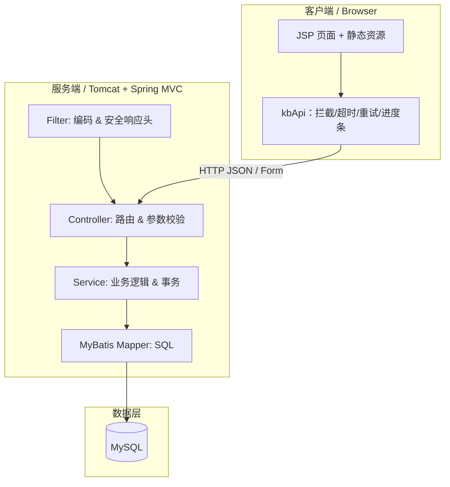
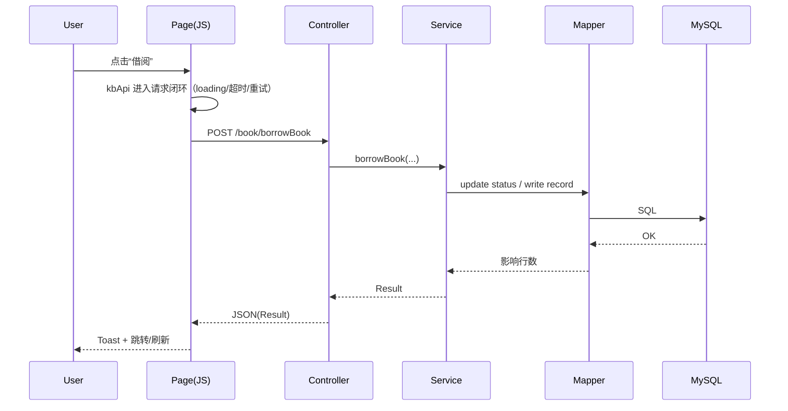

# 文档入口（交互式导航）

> 推荐阅读路径：`index.md` → `ARCHITECTURE.md` → `DEPLOYMENT.md` → `API.md` → `FAQ.md`

## 快速索引
- 架构：`ARCHITECTURE.md`
- 部署：`DEPLOYMENT.md`
- 接口：`API.md`
- 数据库：`DB_SCHEMA.md`
- UI 规范：`STYLE_GUIDE.md`
- 路线图：`ROADMAP.md`
- 常见问题：`FAQ.md`

---

<strong>架构一图流（多维层级）</strong>

<strong>借阅链路（时序）</strong>

---

## 交互式阅读提示
- Mermaid 图：GitHub 会自动渲染（建议在仓库页面直接查看）。
- `
` 可折叠：适合把“概览”与“细节”放在同一页，读起来更不累。

---

## 浏览器自诊断（健康全景图）

项目内置零依赖诊断脚本（默认随管理端页面加载）：

- 在控制台执行：`kbHealth()`
- 开启持续采样：`kbDiagnostics.start(2000)`（每 2s 采样一次内存/长任务）
- 停止采样：`kbDiagnostics.stop()`

> 说明：`performance.memory` 仅在部分 Chromium 浏览器可用；长任务统计依赖 `PerformanceObserver(longtask)` 支持情况。

---

## 虚拟滚动引擎（零依赖）

为未来“超大列表”场景预置 `kbVirtualList`（固定行高 + DOM 复用 + rAF 合并更新）。

- API：`window.kbVirtualList(host, { items, itemHeight, renderItem })`
- 适用：前端持有大数组并需要在滚动容器内渲染列表/卡片时

